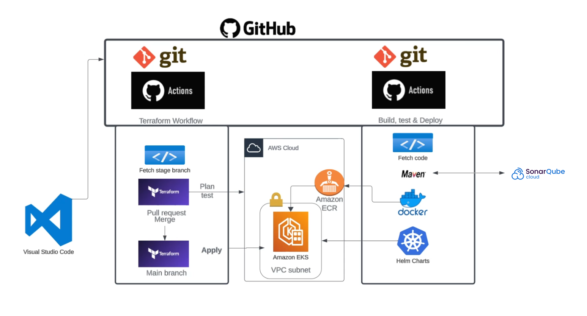

# GitOps Platform Blueprint with GitHub Actions

This repository demonstrates a **GitOps-style delivery pipeline** using **GitHub Actions** to manage both **infrastructure (IaC)** and **application deployment** on AWS.

The goal of this project is to showcase **repository organization, pipeline architecture, separation of concerns, and operational workflows**, rather than to provide a one-click demo.

The project is intentionally designed to be **readable, auditable, and extensible** for real-world DevOps / Platform Engineering scenarios.

---

## Architecture Overview



**Request flow:**

Client → GitHub Actions → AWS Infrastructure (EKS, IAM, Networking)  
Application builds → Container registry → Kubernetes (EKS)  
Supporting services include database, cache, and message broker.
The platform follows a GitOps model where GitHub Actions acts as the control plane for infrastructure and application delivery.


---

## Repository Structure

```text
.
├── infra/ # Infrastructure as Code (Terraform)
│   └── terraform/
├── app/ # Application, CI/CD, and deployment manifests
│   ├── src/
│   ├── kubernetes/
│   ├── ansible/
│   ├── Dockerfile
│   ├── Jenkinsfile
│   └── pom.xml
├── .github/
│   └── workflows/ # GitHub Actions pipelines
├── docs/ # Project documentation
│   ├── SETUP_AWS.md
│   ├── SETUP_GITHUB_SECRETS.md
│   ├── VERIFY.md
│   ├── KNOWN_ISSUES.md
│   └── images/
└── README.md
```

---

## GitOps Workflow Model

- **Infrastructure changes**
  - Managed via Terraform
  - Planned and applied through GitHub Actions
  - State stored remotely (S3 + locking)

- **Application changes**
  - Built, tested, and containerized via GitHub Actions
  - Deployed to Kubernetes (EKS)

- **Separation of concerns**
  - Infrastructure and application live in the same repository
  - Pipelines are scoped by path (`infra/**` vs `app/**`)

---

## Running the Project

This repository does **not** include any credentials or secrets.

To run it yourself, you will need to:

1. Prepare an AWS account
2. Configure IAM permissions
3. Create required AWS resources (S3, ECR, EKS)
4. Add GitHub repository secrets
5. Trigger workflows manually or via commits

Detailed, step-by-step instructions are provided here:

- [AWS Setup Guide](docs/SETUP_AWS.md)
- [GitHub Secrets Setup](docs/SETUP_GITHUB_SECRETS.md)
- [Verification Guide](docs/VERIFY.md)
- [Known Issues & Troubleshooting](docs/KNOWN_ISSUES.md)

---

## Design Goals

- Clear separation of infrastructure and application logic
- Safe-by-default (no embedded secrets)
- GitOps-aligned workflows
- Cost-aware and destroy-friendly

---

## Cleanup & Cost Management

This project provisions cloud infrastructure components that may incur AWS costs if left running.

Although the repository is primarily intended to demonstrate architecture, workflow design, and GitOps practices, a full teardown procedure is documented to ensure safe cleanup when resources are actually deployed.

The cleanup process covers:

- Removing Kubernetes workloads and ingress resources
- Releasing AWS Load Balancers created by EKS
- Destroying infrastructure using Terraform
- Cleaning up Terraform remote state and container registries
- Verifying that no billable AWS resources remain

👉 **Detailed teardown instructions:**  
[Cleanup Guide](docs/CLEANUP.md)

> ⚠️ **Important:**  
> Always remove Kubernetes resources before running `terraform destroy` to avoid orphaned load balancers and blocked teardown operations.

---

## Attribution

This project uses a reference Java application originally popularized in DevOps training material.  
All infrastructure, workflows, documentation, and repository structure were adapted and extended for educational and portfolio purposes.
